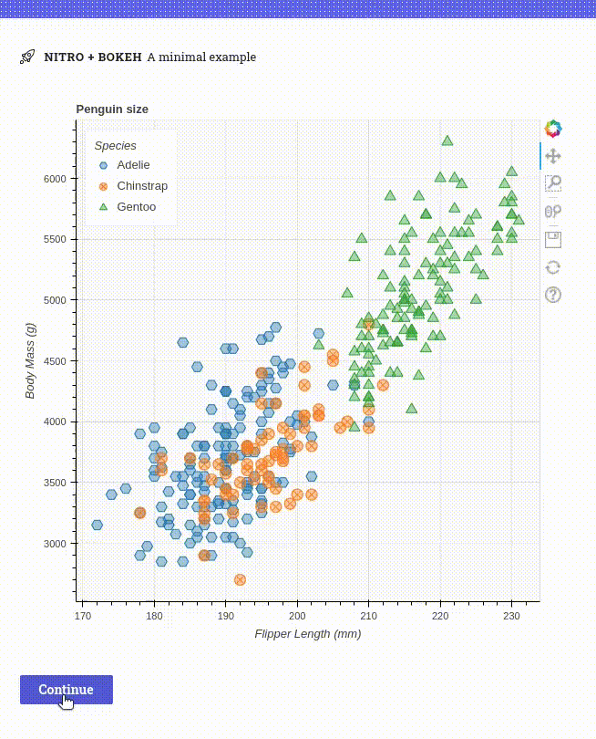

# Bokeh plugin for H2O Nitro

This plugin lets you use [Bokeh](https://docs.bokeh.org/en/latest/) visualizations in [Nitro](https://nitro.h2o.ai)
apps.

## Demo

[View source](example).



## Install

```
pip install h2o-nitro-bokeh
```

## Usage

1. Import `bokeh_plugin` and `bokeh_box` from `h2o_nitro_bokeh`.
2. Add `bokeh_plugin()` to your Nitro app.
3. Use `bokeh_box(model)` to render Bokeh models (figures, widgets, and so on).


```py 
from bokeh.plotting import figure, show
from h2o_nitro import View, web_directory
from h2o_nitro_bokeh import bokeh_plugin, bokeh_box


def main(view: View):
    view(bokeh_box(make_plot()))


nitro = View(
    main,
    title='Nitro + Bokeh',
    caption='A minimal example',
    plugins=[bokeh_plugin()],  # Include the Bokeh plugin
)

def make_plot():
    x = [1, 2, 3, 4, 5]
    y = [6, 7, 2, 4, 5]
    p = figure(title="Simple line example", x_axis_label="x", y_axis_label="y")
    p.line(x, y, legend_label="Temp.", line_width=2)
    return p

```


